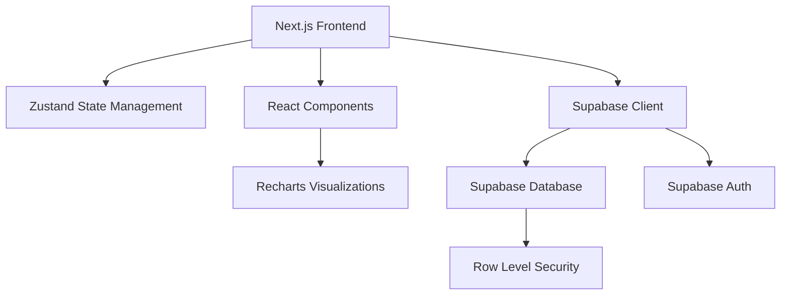
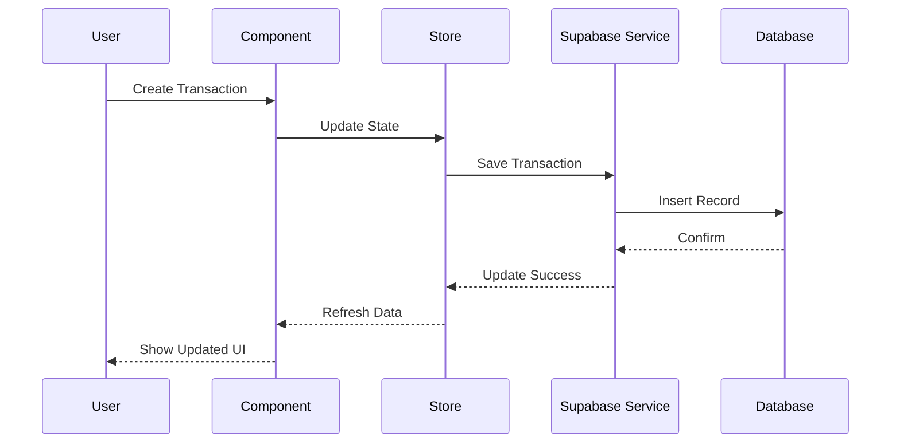

# Money Tracker Feature Design

## Overview

The Money Tracker feature is a comprehensive personal finance management system built on Next.js with Supabase backend. It provides transaction logging, user management, debt/credit tracking, and rich data visualizations. The system leverages the existing project architecture with Zustand for state management, Recharts for visualizations, and Supabase for data persistence and authentication.

## Architecture

### High-Level Architecture



### Data Flow



## Components and Interfaces

### Core Components

#### 1. MoneyDashboard Component
- **Purpose**: Main dashboard displaying overview, top creditors/debtors, and visualizations
- **Location**: `src/components/MoneyDashboard.tsx`
- **Props**: None (uses global state)
- **Features**:
  - Top 5 creditors and debtors cards
  - Transaction summary statistics
  - Quick action buttons for adding transactions/users
  - Responsive grid layout

#### 2. TransactionForm Component
- **Purpose**: Form for creating and editing transactions
- **Location**: `src/components/TransactionForm.tsx`
- **Props**: `{ transaction?: Transaction, onSubmit: (data: TransactionFormData) => void, onCancel: () => void }`
- **Features**:
  - Person selection with autocomplete
  - Amount input with validation
  - Transaction type toggle (Credit/Debit)
  - Date/time picker with current default
  - Form validation and error handling

#### 3. UserManagement Component
- **Purpose**: Interface for managing users (contacts)
- **Location**: `src/components/UserManagement.tsx`
- **Props**: None
- **Features**:
  - User list with search and filter
  - Add/edit user modal
  - User detail view with transaction history
  - Phone number validation

#### 4. TransactionList Component
- **Purpose**: Displays paginated list of transactions with filtering
- **Location**: `src/components/TransactionList.tsx`
- **Props**: `{ userId?: string, limit?: number }`
- **Features**:
  - Infinite scroll or pagination
  - Date range filtering
  - Transaction type filtering
  - Search by person name
  - Sort by date, amount, or person

#### 5. FinancialCharts Component
- **Purpose**: Container for all financial visualizations
- **Location**: `src/components/FinancialCharts.tsx`
- **Props**: `{ timeRange: TimeRange, transactions: Transaction[] }`
- **Features**:
  - Credit vs Debit pie chart
  - Transaction timeline chart
  - Top creditors/debtors bar chart
  - Monthly spending trends line chart
  - Interactive tooltips and legends

#### 6. UserCard Component
- **Purpose**: Reusable card for displaying user summary information
- **Location**: `src/components/UserCard.tsx`
- **Props**: `{ user: User, balance: number, lastTransaction?: Transaction, onClick: () => void }`
- **Features**:
  - User avatar or initials
  - Balance display with color coding
  - Last transaction date
  - Click navigation to user details

### Page Components

#### 1. Money Page (Homepage)
- **Location**: `src/app/money/page.tsx`
- **Purpose**: Main entry point for money tracking features
- **Layout**:
  - Header with quick stats
  - Top creditors/debtors sections
  - Visualization dashboard
  - Recent transactions list
  - Floating action button for quick transaction entry

#### 2. User Detail Page
- **Location**: `src/app/money/users/[id]/page.tsx`
- **Purpose**: Detailed view of specific user relationship
- **Features**:
  - User information display
  - Complete transaction history
  - Balance calculation over time
  - Quick transaction entry for this user

## Data Models

### Database Schema Extensions

#### Transactions Table
```sql
CREATE TABLE transactions (
    id UUID PRIMARY KEY DEFAULT gen_random_uuid(),
    user_id UUID REFERENCES auth.users(id) ON DELETE CASCADE,
    person_id UUID REFERENCES persons(id) ON DELETE CASCADE,
    amount DECIMAL(10,2) NOT NULL CHECK (amount > 0),
    transaction_type transaction_type_enum NOT NULL,
    description TEXT,
    transaction_date TIMESTAMPTZ NOT NULL DEFAULT NOW(),
    created_at TIMESTAMPTZ DEFAULT NOW(),
    updated_at TIMESTAMPTZ DEFAULT NOW()
);

CREATE TYPE transaction_type_enum AS ENUM ('credit', 'debit');
```

#### Persons Table
```sql
CREATE TABLE persons (
    id UUID PRIMARY KEY DEFAULT gen_random_uuid(),
    user_id UUID REFERENCES auth.users(id) ON DELETE CASCADE,
    name VARCHAR(255) NOT NULL,
    phone_number VARCHAR(20) UNIQUE,
    created_at TIMESTAMPTZ DEFAULT NOW(),
    updated_at TIMESTAMPTZ DEFAULT NOW()
);
```

### TypeScript Interfaces

#### Transaction Interface
```typescript
interface Transaction {
    id: string;
    user_id: string;
    person_id: string;
    amount: number;
    transaction_type: 'credit' | 'debit';
    description?: string;
    transaction_date: string;
    created_at: string;
    updated_at: string;
    person?: Person; // Joined data
}
```

#### Person Interface
```typescript
interface Person {
    id: string;
    user_id: string;
    name: string;
    phone_number: string;
    created_at: string;
    updated_at: string;
}
```

#### Balance Summary Interface
```typescript
interface BalanceSummary {
    person_id: string;
    person_name: string;
    total_credit: number;
    total_debit: number;
    net_balance: number;
    last_transaction_date: string;
    transaction_count: number;
}
```

## State Management

### Zustand Store Structure

#### MoneyStore
```typescript
interface MoneyStore {
    // State
    transactions: Transaction[];
    persons: Person[];
    balanceSummaries: BalanceSummary[];
    loading: boolean;
    error: string | null;
    
    // Actions
    fetchTransactions: (filters?: TransactionFilters) => Promise<void>;
    createTransaction: (data: CreateTransactionData) => Promise<void>;
    updateTransaction: (id: string, data: UpdateTransactionData) => Promise<void>;
    deleteTransaction: (id: string) => Promise<void>;
    
    fetchPersons: () => Promise<void>;
    createPerson: (data: CreatePersonData) => Promise<void>;
    updatePerson: (id: string, data: UpdatePersonData) => Promise<void>;
    deletePerson: (id: string) => Promise<void>;
    
    fetchBalanceSummaries: () => Promise<void>;
    getTopCreditors: (limit: number) => BalanceSummary[];
    getTopDebtors: (limit: number) => BalanceSummary[];
    
    clearError: () => void;
}
```

## Services Layer

### MoneyService
- **Location**: `src/services/moneyService.ts`
- **Purpose**: Abstraction layer for all money-related Supabase operations
- **Methods**:
  - `getTransactions(filters?: TransactionFilters): Promise<Transaction[]>`
  - `createTransaction(data: CreateTransactionData): Promise<Transaction>`
  - `updateTransaction(id: string, data: UpdateTransactionData): Promise<Transaction>`
  - `deleteTransaction(id: string): Promise<void>`
  - `getPersons(): Promise<Person[]>`
  - `createPerson(data: CreatePersonData): Promise<Person>`
  - `updatePerson(id: string, data: UpdatePersonData): Promise<Person>`
  - `deletePerson(id: string): Promise<void>`
  - `getBalanceSummaries(): Promise<BalanceSummary[]>`

### Analytics Service
- **Location**: `src/services/analyticsService.ts`
- **Purpose**: Data processing for visualizations and insights
- **Methods**:
  - `getTransactionTrends(timeRange: TimeRange): Promise<TrendData[]>`
  - `getCreditDebitDistribution(): Promise<DistributionData>`
  - `getTopTransactionPartners(limit: number): Promise<PartnerData[]>`
  - `getMonthlySpendingPattern(): Promise<SpendingPattern[]>`

## Visualization Strategy

### Chart Types and Libraries

#### 1. Pie Chart - Credit vs Debit Distribution
- **Library**: Recharts PieChart
- **Data**: Aggregated credit and debit totals
- **Features**: Interactive segments, percentage labels, custom colors

#### 2. Line Chart - Transaction Timeline
- **Library**: Recharts LineChart
- **Data**: Daily/weekly/monthly transaction volumes
- **Features**: Multiple lines for credits/debits, zoom functionality, tooltips

#### 3. Bar Chart - Top Creditors/Debtors
- **Library**: Recharts BarChart
- **Data**: Top 10 people by balance amount
- **Features**: Horizontal bars, color coding for positive/negative, click navigation

#### 4. Area Chart - Balance Over Time
- **Library**: Recharts AreaChart
- **Data**: Running balance calculations over time
- **Features**: Gradient fill, baseline at zero, interactive tooltips

### Responsive Design Strategy
- Mobile-first approach with breakpoints at 640px, 768px, 1024px
- Chart containers with aspect ratio preservation
- Collapsible sections for mobile optimization
- Touch-friendly interaction targets

## Error Handling

### Error Categories
1. **Network Errors**: Connection issues, timeouts
2. **Validation Errors**: Invalid form data, business rule violations
3. **Authentication Errors**: Session expiry, permission issues
4. **Database Errors**: Constraint violations, foreign key issues

### Error Handling Strategy
- Global error boundary for unhandled exceptions
- Form-level validation with real-time feedback
- Toast notifications for user actions
- Retry mechanisms for transient failures
- Graceful degradation for offline scenarios

### Error Recovery
- Automatic retry for failed network requests
- Local state persistence during connectivity issues
- Clear error messages with actionable guidance
- Fallback UI states for missing data

## Testing Strategy

### Unit Testing
- **Framework**: Vitest with React Testing Library
- **Coverage**: All service functions, utility functions, custom hooks
- **Mocking**: Supabase client, external dependencies

### Component Testing
- **Scope**: All React components with user interactions
- **Focus**: User workflows, form validation, error states
- **Tools**: React Testing Library, MSW for API mocking

### Integration Testing
- **Database**: Test database operations with real Supabase instance
- **Authentication**: Test auth flows and permission boundaries
- **End-to-End**: Critical user journeys using Playwright

### Performance Testing
- **Metrics**: Component render times, bundle size analysis
- **Tools**: React DevTools Profiler, Lighthouse CI
- **Targets**: <100ms interaction response, <3s initial load

## Security Considerations

### Row Level Security (RLS)
```sql
-- Transactions RLS Policy
CREATE POLICY "Users can only access their own transactions" ON transactions
    FOR ALL USING (auth.uid() = user_id);

-- Persons RLS Policy  
CREATE POLICY "Users can only access their own persons" ON persons
    FOR ALL USING (auth.uid() = user_id);
```

### Data Validation
- Server-side validation for all inputs
- SQL injection prevention through parameterized queries
- XSS protection through proper data sanitization
- CSRF protection via Supabase built-in mechanisms

### Privacy Protection
- Phone number encryption at rest
- Audit logging for sensitive operations
- Data retention policies
- GDPR compliance for user data deletion

## Performance Optimization

### Database Optimization
- Indexes on frequently queried columns (user_id, transaction_date, person_id)
- Materialized views for complex aggregations
- Connection pooling for high concurrency
- Query optimization with EXPLAIN ANALYZE

### Frontend Optimization
- Code splitting by route and feature
- Lazy loading for charts and heavy components
- Virtual scrolling for large transaction lists
- Memoization for expensive calculations
- Service worker for offline functionality

### Caching Strategy
- Browser caching for static assets
- SWR/React Query for API response caching
- Local storage for user preferences
- CDN caching for public resources